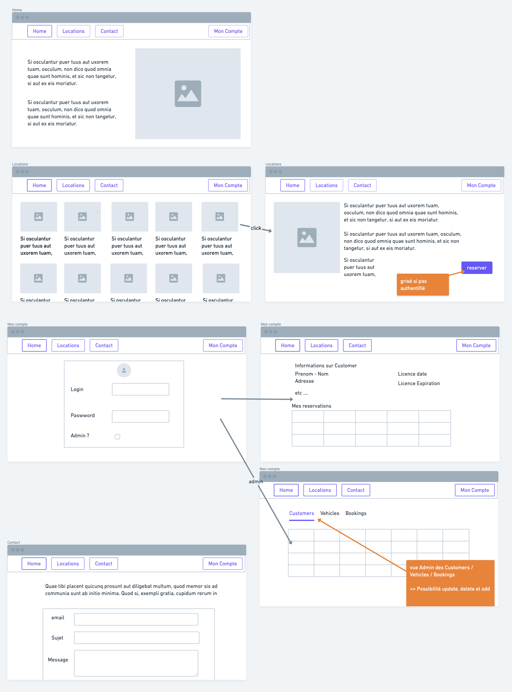

# Framework WEB - Projet : Car Rental

## Objectif du projet
Développer le front end d'une application de location de vehicules en utilisant un framework Web moderne : Angular. 

Mettre en application les méthodes et outils étudiés lors des 2 premiers modules:  Git et Agile

Vous réaliserez ce projet en **binôme**.

## Livrables
- Un dépot github pour le binôme contenant: 
  - l'application fonctionnelle et versionnée
  - un dossier **documentation** contenant les livrables demandés
  - les droits octroyé à mon profil pour que je puisse procéder à la correction.
- Des screenshots. **A CHAQUE** 
  - SPRINT: un screenshot du kanban du sprint à venir dans le dossier /documentation/sprints/kanban_sprint1.jpg
  -  FIN DE SPRINT: un screenshot du kanban à jour avec un REX du sprint efffectué dans documentation/sprint/kanban_sprint1_termine.jpg et documentation/sprint/rex_sprint1.pdf
- Le [fichier evaluation/evaluation_projets.xls](evaluation/evaluation_projets.xls) à remplir **individuelement** et mettre dans le dossier **documentation** sous la forme prenom_nom_evaluation.xls
- Un rapport individuel d'une a deux pages maximum indiquant
  - Dans quelle mesure l'application répond aux requis fonctionnels définis ci dessous
  - Les parties sur lesquelles vous avez travaillé, 
  - Les choix techniques effectués (Composants, Classe, Service, ...?)
  - Une retrospective du projet (ce qui s'est bien passé, moins bien passé, ce qui vous a aidé, ...)
- [Sondage sur le projet](https://framaforms.org/casir-lp-2020-2021-framework-web-1618480021) rempli
- (Bonus) Une démo de l'application filmée sur votre ordi
  

## Evaluation
Le projet permet d'évaluer sur un cas concret les 2 précédents modules (Git et Agile) en plus du framework web Angular. Tout ce que l'on a pu voir doit donc y être appliqué.

Notamment:
* Elaborer un story mapping à mettre dans le repertoire **Documentation**
* Avoir au moins une issue sur Github par fonctionnalité sous la forme "En tant que, je veux .."
* Mettre en place des itérations (regrouper des issues en milestones)
* Une branche par fonctionnalité
* Des commits référençant l’issue
* Une pull request pour merger la fonctionnalité quand on est sûr que celle-ci est fonctionnelle avec code review si necessaire.
* Un kanban pour permettre de suivre votre avancement et les screenshots associés (cf livrables)
* Mettre en place quelques tests sur 1 component

la revue de code sur Angular portera sur :
* Clarté du code et documentation de celui-ci
* Clarté du découpage en composants, fonctionnalités
* Pertinence des choix effectués (Composants, classes, services, modules, tests...)

Lors de la dernière séance une présentation par le binôme du projet et discussion autour du travail sera a prévoir.

## Requis fonctionnels Minimum de l'application
L'application proposée doit satisfaire les besoins fonctionnels définis ci dessous. Un mockup est disponible en annexe, vous pouvez réaliser le votre avant de commencer et le mettre dans le repertoire **Documentation** si vous le souhaitez.

### Partie Client:
* Avoir une Page d'accueil du site
* Avoir une page contact qui envoie un message (affiché en console seulement)
* Afficher la liste de tous les vehicules disponibles
* Pouvoir effectuer au moins 2 filtres sur cette liste de vehicules
* Pouvoir afficher les details d'un vehicule selectionné
* Pouvoir reserver un vehicule si l'utilisateur est connecté
* Pouvoir se connecter et se deconnecter 
  * Utilisateur
  * Admin (qui aura le droit d'accéder à la partie Admin)
* Pouvoir voir les infos de l'utilisateur sur sa page compte et l'historique des reservations effectuées si on est connecté

### Partie Admin:
* Ces pages doivent être protégées suite à un login et reservé a l'utilisateur qui est Admin
* Pouvoir afficher une liste d'elements (Customer ou Vehicle ou Booking)
* Pouvoir Ajouter, Modifier et supprimer un element

### Fonctionnalités
Vous pouvez ensuite intégrer de nouvelles fonctionnalités a l'application en vous basant sur l'API disponible.

Pensez bien à réaliser un story mapping le plus complet possible avant de commencer, tester l'API pour voir ce qui est à disposition et découper en versions réalisables et pas trop grosses. A vous de choisir également la durée des sprints en fonction des scéances de l'emploie du temps.

Bien évidement si le storymap est complet tout ne pourra être implémenté mais c'est normal.

# Ressources

## Support et cours
* [Doc officielle](https://angular.io/docs)
* [Tuto officiel étape par étape](https://angular.io/tutorial)
* [Courrs OpenClassRooms](https://openclassrooms.com/fr/courses/7471261-debutez-avec-angular)
* [Série de tutoriels très détaillés](https://www.ganatan.com/tutorials/demarrer-avec-angular)

## Backend
Pour lancer le serveur backend, il sufit en console de faire un `java -jar carRental-0.0.5.jar`

Une fois lancé, vous pouvez accéder au serveur sur l'adresse `http://localhost:8080`

La page d'accueil vous permet de voir la documentation de l'API mise à disposition. Cette API propose plusieurs Endpoint regroupés par Objet (Vehicle, Customer, Booking)

Vous pouvez lancer n'importe quelle Endpoint en faisant "try it out" puis "execute".
N'oubliez pas de fournir des objets lorsque necessaire (modification, ajout), ou des informations (id), etc

Le format des objet vous est donné comme exemple dans la documentation de chaque Endpoint

Les données sont sauvegardées dans une BDD en mémoire donc perdues à chaque redémarage du serveur. Vous pouvez découvrir et faire plein de tests pour mettre en place un scénario fonctionnel qui vous conviendra.

# Annexes
### Github exemple d'attendu
Vous trouverez sur ce [dépot](https://github.com/gbesset-formateur/etu-iut-casir-agile-git-example) un exemple de ce qui est attendu concernant l'intégration de la méthode Agile dans Github. Il vous est demandé :
* Avoir un Kanban pour suivre votre évolution par millestone
* Avoir des milestones regroupant des user stories
* Avoir des user stories
* lier ses comits a une user story
* fermer les issues une fois terminé
  

### Informations diverses
#### backend java
* La version 0.0.5 est la version non sécurisée ou n'importe quel user peut faire des actions (Add et Delete)
* La version 0.1.0 est la version sécurisée ou les actions d'admin (Add, Delete) sont protégées par un token qu'il faut récupérer via le login. (En cours de développement à ce jour)

#### API booking
Lorsque vous utilisez booking il n'est pas necessaire de mettre les objets complets de customer et vehicle dans la requete. seul leur **Id** suffit.

### Mockup application
